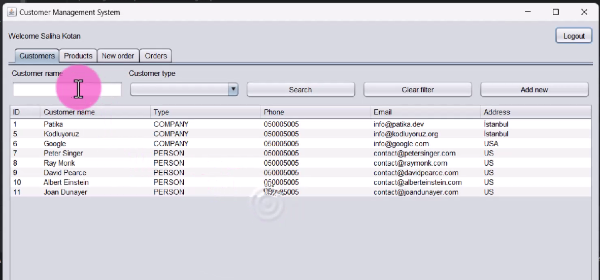
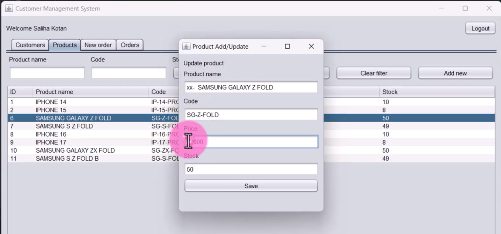
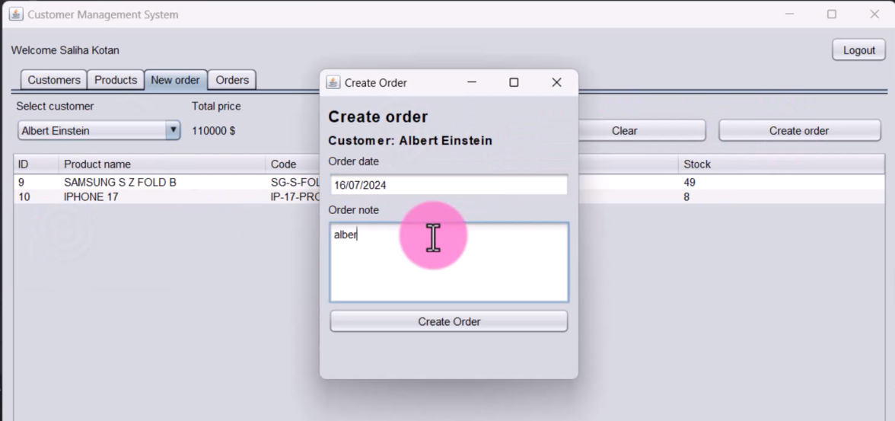
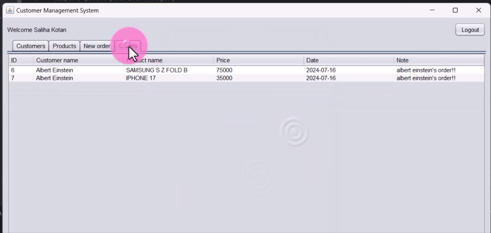

# Order Management System (Java Swing) :gem::hibiscus:

This project assignment has been prepared for the 'Kodluyoruz' Backend Java course. It is a sample order management system.

***VIDEO:*** https://www.youtube.com/watch?v=0Fbie0uRqtM

---

---

---

---

